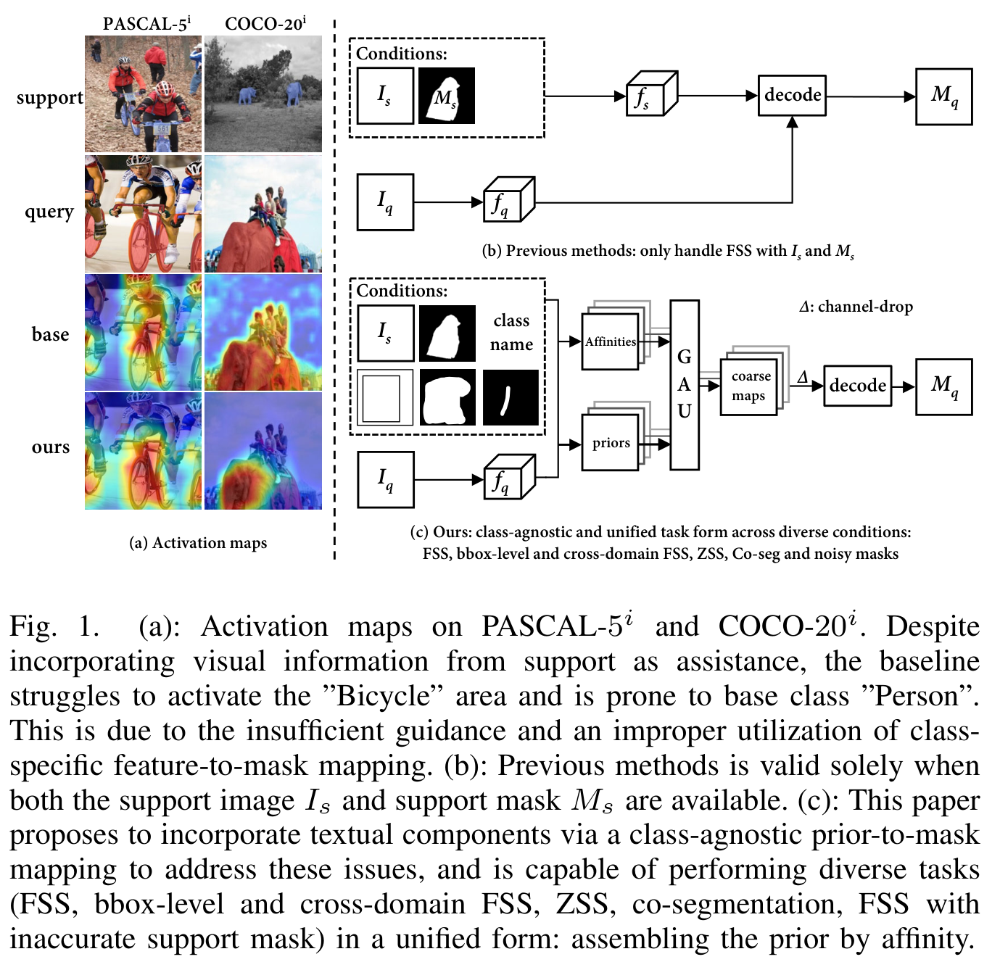
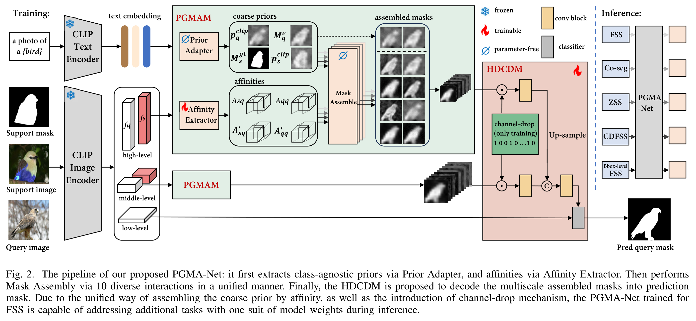
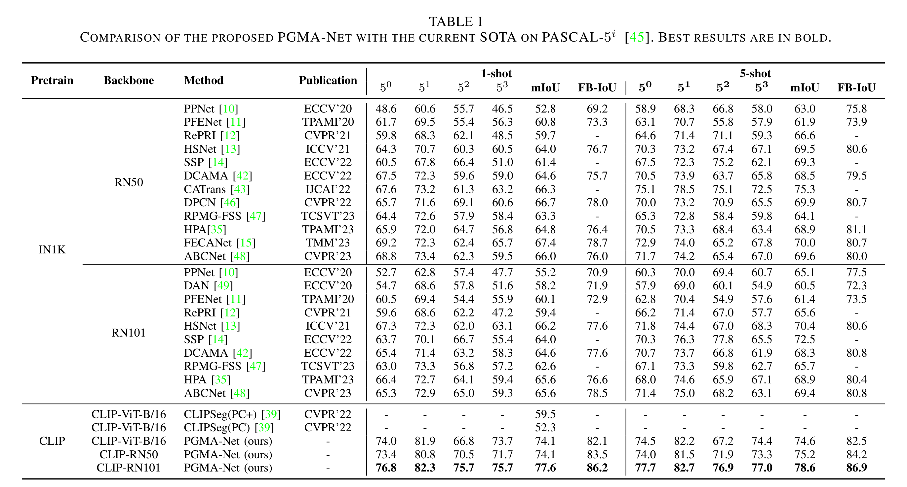
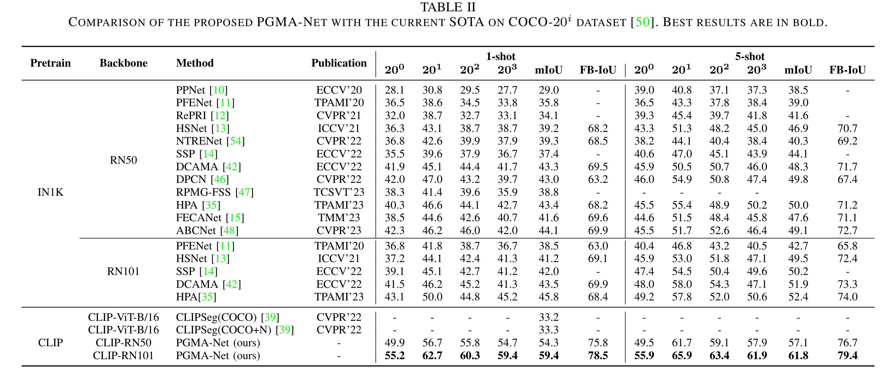

# PGMA-Net

Visual and Textual Prior Guided Mask Assemble for Few-Shot Segmentation and Beyond. [Link to paper](https://arxiv.org/abs/2308.07539)

## Abstract

Few-shot segmentation (FSS) aims to segment the novel classes with a few annotated images. Due to CLIP's advantages of aligning visual and textual information, the integration of CLIP can enhance the generalization ability of FSS model. However, even with the CLIP model, the existing CLIP-based FSS methods are still subject to the biased prediction towards base classes, which is caused by the class-specific feature level interactions. To solve this issue, we propose a visual and textual Prior Guided Mask Assemble Network (PGMA-Net). It employs a class-agnostic mask assembly process to alleviate the bias, and formulates diverse tasks into a unified manner by assembling the prior through affinity. Specifically, the class-relevant textual and visual features are first transformed to class-agnostic prior in the form of probability map. Then, a Prior-Guided Mask Assemble Module (PGMAM) including multiple General Assemble Units (GAUs) is introduced. It considers diverse and plug-and-play interactions, such as visual-textual, inter- and intra-image, training-free, and high-order ones. Lastly, to ensure the class-agnostic ability, a Hierarchical Decoder with Channel-Drop Mechanism (HDCDM) is proposed to flexibly exploit the assembled masks and low-level features, without relying on any class-specific information. It achieves new state-of-the-art results in the FSS task, with mIoU of $77.6$ on $\text{PASCAL-}5^i$ and $59.4$ on $\text{COCO-}20^i$ in 1-shot scenario. Beyond this, we show that without extra re-training, the proposed PGMA-Net can solve bbox-level and cross-domain FSS, co-segmentation, zero-shot segmentation (ZSS) tasks, leading an any-shot segmentation framework. 

## motivation


## framework


## pascal-5i


## coco-20i


## Prepare the Datasets

Enter the `data` directory, create and enter the directory `coco` and download the COCO 2017 train and val images and the COCO 2014 annotations from the [COCO website](https://cocodataset.org/#download):

```bash
cd data
mkdir coco
cd coco
wget http://images.cocodataset.org/zips/train2017.zip
wget http://images.cocodataset.org/zips/val2017.zip
wget http://images.cocodataset.org/annotations/annotations_trainval2014.zip
```

Unzip the files:

```bash
unzip train2017.zip
unzip val2017.zip
unzip annotations_trainval2014.zip
rm -rf train2017.zip val2017.zip annotations_trainval2014.zip
```

The `coco` directory should now contain the following files and directories:

```
coco
├── annotations
│   ├── captions_train2014.json
│   ├── captions_val2014.json
│   ├── instances_train2014.json
│   ├── instances_val2014.json
|   ├── person_keypoints_train2014.json
|   └── person_keypoints_val2014.json
├── train2017
└── val2017
```

Now, join the images of the train and val sets into a single directory:

```bash
mv val2017/* train2017
mv train2017 train_val_2017
rm -rf val2017
```

Finally, you will have to rename image filenames in the COCO 2014 annotations to match the filenames in the `train_val_2017` directory. To do this, run the following script:

```bash
python main.py rename_coco20i_json --instances_path data/coco/annotations/instances_train2014.json
python main.py rename_coco20i_json --instances_path data/coco/annotations/instances_val2014.json
```

Setting up [PASCAL VOC 2012](http://host.robots.ox.ac.uk/pascal/VOC/) Dataset with augmented data.

### 1. Instruction to download
``` bash
bash data/script/setup_voc12.sh data/pascal
``` 
```bash
data/
└── pascal/
    ├── Annotations
    ├── ImageSets/
    │   └── Segmentation
    ├── JPEGImages
    ├── SegmentationObject
    └── SegmentationClass
``` 
### 2. Add SBD Augmentated training data
- Convert by yourself ([here](https://github.com/shelhamer/fcn.berkeleyvision.org/tree/master/data/pascal)).
- Or download pre-converted files ([here](https://github.com/DrSleep/tensorflow-deeplab-resnet#evaluation)), **(Prefer this method)**.

After the download move it into the pascal folder.

```bash
unzip SegmentationClassAug.zip -d data/pascal
```

```bash
data/
└── pascal/
    ├── Annotations
    ├── ImageSets/
    │   └── Segmentation
    ├── JPEGImages
    ├── SegmentationObject
    ├── SegmentationClass
    └── SegmentationClassAug #ADDED
``` 

### 3. Download official sets as ImageSets/SegmentationAug list
From: https://github.com/kazuto1011/deeplab-pytorch/files/2945588/list.zip

```bash
# Unzip the file
unzip list.zip -d data/pascal/ImageSets/
# Move file into Segmentation folder
mv data/pascal/ImageSets/list/* data/pascal/ImageSets/Segmentation/
rm -rf data/pascal/ImageSets/list
```

This is how the dataset should look like
```bash
/data
└── pascal
    ├── Annotations
    ├── ImageSets
    │   └── Segmentation 
    │       ├── test.txt
    │       ├── trainaug.txt # ADDED!!
    │       ├── train.txt
    │       ├── trainvalaug.txt # ADDED!!
    │       ├── trainval.txt
    │       └── val.txt
    ├── JPEGImages
    ├── SegmentationObject
    ├── SegmentationClass
    └── SegmentationClassAug # ADDED!!
        └── 2007_000032.png
```


## training
```
CUDA_VISIBLE_DEVICES=0 python train.py --fold=0 --benchmark=pascal --bsz=16 --niter=100 --logpath=pascal/CLIPRN101  --nworker=8 --lr=1e-4
```

## testing

```
CUDA_VISIBLE_DEVICES=0 python test.py --fold=0 --benchmark=pascal --bsz=16 --visualize --nworker=4 --load=checkpoints/pascal5i-CLIPRN101/fold0/epoch_65_miou_76.80891418457031.pt
```

## trained model for pascal-5i under CLIP-RN101
see:
```
checkpoints/pascal5i-CLIPRN101
```

## Citation
```bibtex
@article{chen2024visual,
  title={Visual and Textual Prior Guided Mask Assemble for Few-Shot Segmentation and Beyond},
  author={Chen, Shuai and Meng, Fanman and Zhang, Runtong and Qiu, Heqian and Li, Hongliang and Wu, Qingbo and Xu, Linfeng},
  journal={IEEE Transactions on Multimedia},
  year={2024},
  publisher={IEEE}
}
```